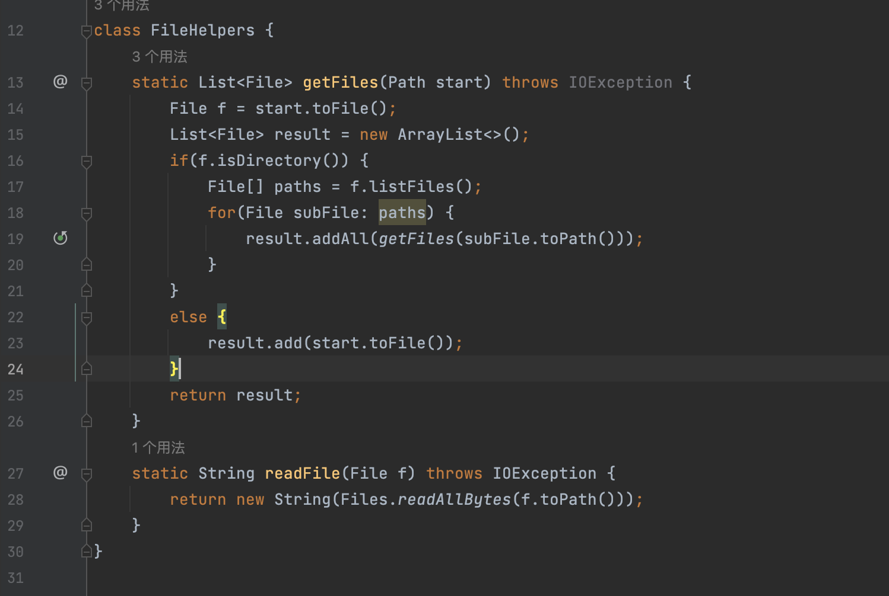

# lab4
### 11/13/22
### Wangkai Qiu
## Part 1. 
### /File[]iSystem.out.println(f.toString()+" is directory”);<\Enter><\esc>:wq<\Enter>

> ###  1. Use backslash, "/", in order to search for the term, "File[]", which is the line where we want to insert new line.
### 
> ###  2. After pressing <\Enter>, the cursor is brought to the beginning of the line.
### 
> ###  3. Then press i in order to change to insert mode. In the lower left side of the screen, the word, "insert", is shown.
### 
> ###  4. Then type "System.out.println(f.toString()+" is directory”);".
### 
> ###  5. Press <\Enter> to separate two lines.
### 
> ###  6. Press <\esc> to turn off the insert mode and save the file and quit by typing <\shift>:wq.
### 
### 
# *************************************************************************
## Part 2. 
### 
### 
### - For the first trial of trying the first style, log in to ssh and use Vim for editing, if running remotely, it's better and faster to run bash test.sh because you don't have to open the folder on your local machine to Production Editing, In the second trial, I could save some time by copy and pasting the command I used before.
### 
### 
### - For the first trial of trying the second style, I could save much more time than when I used the first style. By using vim in the remote server directly, I didn't have to spend time in opening and closing Visual Studio Code.

### Among these two styles, one factor that may have influenced the decision to choose style 1 over style 2 is that when I want code that already exists on my local computer, if I want to edit it for a while it is better than going in and out of vim and Save less time when exiting a file.
### If I have to constantly switch from one java file to another to compare or connect, it would be easier to use Visual Code because I can open multiple screen at one time. For the projects that I have to fix multiple java files at the same time, first style would be a better choice.

