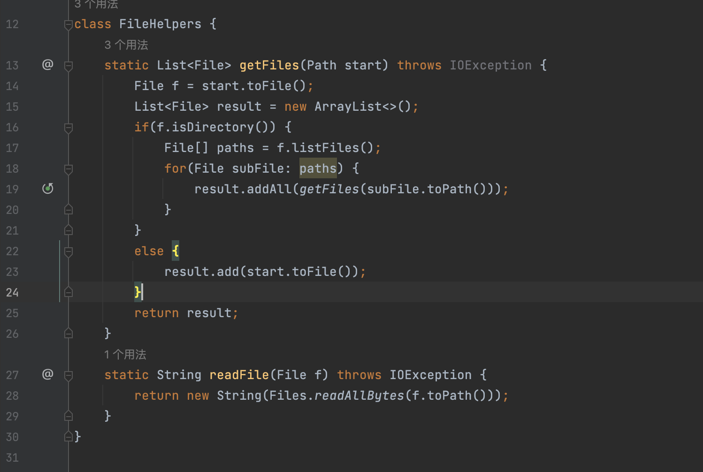
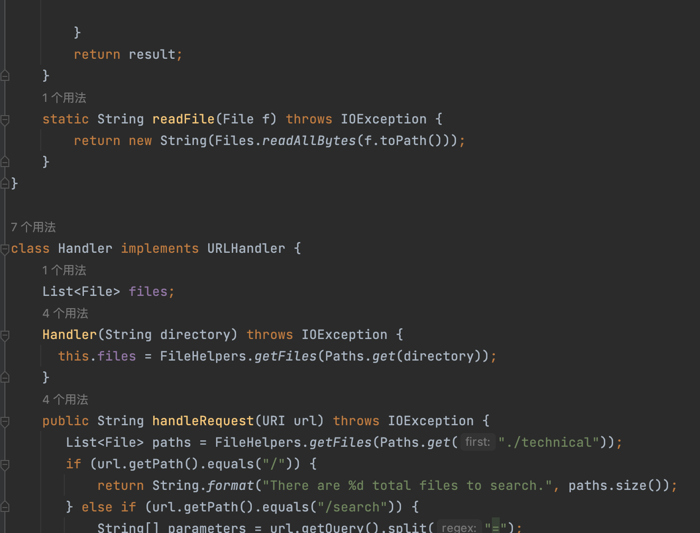
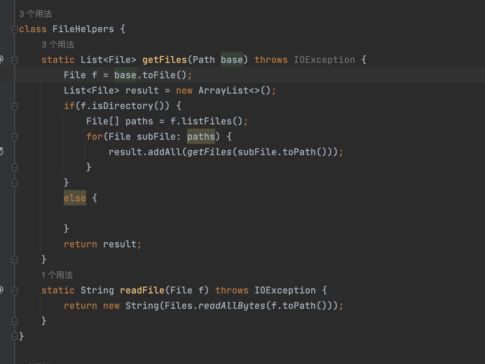
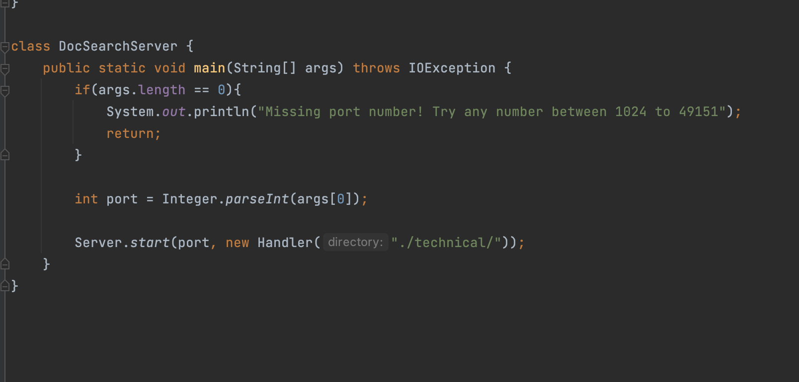

# lab4
### 11/13/22
### Wangkai Qiu
## Part 1. 
### /File[]iSystem.out.println(f.toString()+" is directory”);<\Enter><\esc>:wq<\Enter>

> ###  1. Use backslash, "/", in order to search for the term, "File[]", which is the line where we want to insert new line.
> 
> ###  2. After pressing <\Enter>, the cursor is brought to the beginning of the line.
### 
> ###  3. Then press i in order to change to insert mode. In the lower left side of the screen, the word, "insert", is shown.
### 
> ###  4. Then type "System.out.println(f.toString()+" is directory”);".
### 
> ###  5. Press <\Enter> to separate two lines.
### 
> ###  6. Press <\esc> to turn off the insert mode and save the file and quit by typing <\shift>:wq.
### 

# *************************************************************************
## Part 2. 
### 
### 
### - For the first trial of trying the first style, log in to ssh and use Vim for editing, if running remotely, it's better and faster to run bash test.sh because you don't have to open the folder on your local machine to Production Editing, In the second trial, I could save some time by copy and pasting the command I used before.
### 
### 
### - While I'm looking at the first way to save more time, for a first attempt at trying the second way, by using vim directly in the remote server.

### first style will be a better choice for projects that need to modify multiple java files at the same time, switching from one java file to another for comparison or connection.

